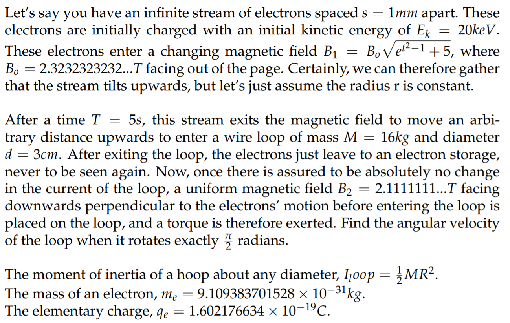

# Peerwise
My questions on Peerwise.

## InfiniteStream (Magnetostatic)

  

### Question
Let's say you have an infinite stream of electrons spaced s = 1mm apart. These electrons are initially charged with an initial kinetic energy of Ek = 20keV. These electrons enter a changing magnetic field , where Bo = 2.3232323232...T facing out of the page. Certainly, we can therefore gather that the stream tilts upwards, but let's just assume the radius r is constant.

After a time T = 5s, this stream exits the magnetic field to move an arbitrary distance upwards to enter a wire loop of mass M = 16kg and diameter d = 3cm. After exiting the loop, the electrons just leave to an electron storage, never to be seen again. Now, once there is assured to be absolutely no change in the current of the loop, a uniform magnetic field B2 = 2.1111111...T facing downwards perpendicular to the electrons' motion before entering the loop is placed on the loop, and a torque is therefore exerted. Find the angular velocity of the loop when it rotates exactly  radians.

The moment of inertia of a hoop about any diameter, .

The mass of an electron, .

The elementary charge, .

## Inator (Electrostatic)

### Question

Let's say you have devised a system called the "Stop-Time-inator" that has allowed you to momentarily stop time. In that moment, no effect of force is seen but the force you yourself apply, and your physical body does not age. You thus stop time and open up a dimension, let's just call this the Cartesian Dimension, where it's just a single infinite plane with no gravitational force present. You enter it, starting at a certain origin which is assumed to be the centre of this dimension. From here, you can also see four paths around you, representing the positive and negative x-axis and positive and negative y-axis of the Cartesian Coordinate plane. Now, in stopped time, you get to work.

You bring along a device called the "Charged-Particle-inator" which releases a charged particle of charge q, set by the user. Now, you place your hand on the knob and cover the dial so that you cannot see the charge q that you set. You turn the knob and release it. Let's say this charge is denoted as a value qo.

Now, you decide to do very interesting thing: you use the python random module to generate a random integer between 2 and a super large number. You label this value as k in the interpreter, but do not check what k is. Now you load this values of k into a "Move-inator", which allows you to go to a specific x and y with respect to the assumed origin. What this "Move-inator" now does is it sends the&nbsp;"Charged-Particle-inator" to points (kn, kn) for all n from 0 to infinity (let's just assume that the "Move-inator" is able to do this within the stopped time) and releases one charge there.

Now it returns, and you haven't died (consider yourself lucky). Now you have set the Move-inator to go to the points&nbsp;(-kn,- kn) for all n from 0 to infinity (again, let's just assume that the "Move-inator" is able to do this within the stopped time), and to each n, it swaps another charge knob that toggles the charge between positive and negative while keeping the magnitude intact (i.e. at (-k0, -k0), a negative charge of qo is released, while at (-k, -k), a positive charge of qo is released and so on).&nbsp;

Now you use another device you have created called the "Uncharge-inator" and use it to completely discharge yourself, and then another called the "Charge-inator" to charge yourself to the same qo which you still do not know. Now you relocate to the assumed origin and stop the the "Stop-Time-inator". What is the acceleration that you, a 60-year old esteemed physicist who has spent years devising this complex system and has a mass of m, experience?

### Answer

To calculate this, you must use the formula F = (1/4&pi;&epsilon;0) * (Qq/r2).

Here, we know that Q and q are both equal to qo, which you already know as a constant, but the direction may change based on the charge of the charges dropped by the "Charged-Particle-inator".

Thus, you extract it as F = (qo/4&pi;&epsilon;0) * 1/r2.

To calculate r2, what you do is you calculate based on the points as given. From this we have r2 = k2n + k2n = 2k2n. 

We thus derive a series representing the force exhibited for the positive direction (i.e. x and y are both positive) F1 =&nbsp;(qo/4&pi;&epsilon;0) * (1/2k0&nbsp;+ 1/2k2 + 1/2k4 + ....), which faces south-west.

Meanwhile, we can also derive a similar&nbsp;series representing the force exhibited for the positive direction (i.e. x and y are both positive) F2 = (qo/4&pi;&epsilon;0) * (1/2k0&nbsp;- 1/2k2 + 1/2k4&nbsp;- ....), which faces south-west as well.

We add these two forces up and we get Fnet =&nbsp;(qo/4&pi;&epsilon;0) *&nbsp;(1/k0&nbsp;+ 1/k4&nbsp;+ 1/k8&nbsp;+ ....), which faces south-west.

Now, I would like to divert to derive an expression for S = 1/k0 + 1/k4 + 1/k8 + ...

To do this, we derive k4S = k4 + 1/k0 + 1/k4 + .... = k4 + S

From this, we get S = k4/(k4 - 1)

Now substituting back in, we get Fnet =&nbsp;(qo/4&pi;&epsilon;0) * (k4/(k4 - 1)) = ma

:. a =&nbsp;(qo/4&pi;&epsilon;0) * (k4/m(k4 - 1)), facing south-west

